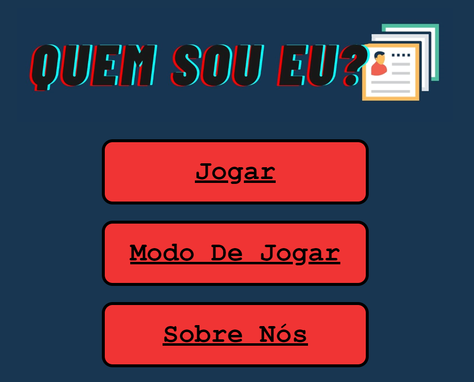

  

 **Quem Sou eu?**
**quem-sou-eu-personagens**
-

**Objetivo do jogo:** 

O objetivo do jogo é descobrir o personagem que seu adversário
selecionou por meio de perguntas

**Como jogar:**

Escolha um dos personagens disponíveis para iniciar o jogo;
Escolha uma das perguntas de sim ou não disponibilizadas na tela, para tentar
adivinhar as características do seu adversário.
Preste atenção nas imagens disponíveis para fazer as perguntas corretas e não
desperdiçar suas tentativas.

**Regras:**

1. O jogador precisa escolher um dos personagens disponíveis no jogo.
2. Cada jogador faz perguntas que só podem ser respondidas com "sim" ou
"não", com o objetivo de descobrir a identidade da pessoa escolhida.
3. Se um jogador adivinhar corretamente a identidade da pessoa, ele é o
vencedor. Se nenhum jogador adivinhar a identidade, o jogador que escolheu a
pessoa é o vencedor.
4. É permitido um número limitado de perguntas por jogador.
5. Não são permitidas dicas adicionais.
6. O jogador deve escolher uma pergunta por vez e aguardar a vez do oponente 
